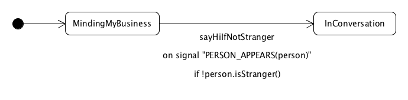

# Anno State Machine crash course

## Introduction
Anno state machine is a library for Android/java code that allows you to write state machines easily without having to bother with writing code for signal dispatch, state transitions and thread handover among other things.

`
Anno state machine allows you to focus on the states and transitions in your application instead of writing state machine boiler plate code.
`

## How do you use the library
You add the library dependencies to your build.gradle file when building Android apps with gradle. The library contains an Annotation processor that runs when the code is compiled.

This is the usage flow of the library:

### Generating the state machine implementations
1. The annotation processor finds all state machine definitions. (More on the syntax later). If you create a new state machine, you'll have to recompile the app before using the implementation so that the annotation processor is run and the code is generated.
2. Each state machine definition is parsed and state machine implementations are generated for these classes. The generated class is placed in a sub package, of the one in which the definition resides, named **generated**. A suffix is added to the class name, f.i. CallHandlingStateMachine -> CallHandlingStateMachine**Impl**.
3. The compilation step will fail with one or more errors if there are errors in the state machine definition.

### Optional - Investigating the state machine by generating a graph
4. Open a generated state machine class and find a line that starts with the following. It can be found in the initial commented out lines of the class.
~~~~
// {"nodes":[{"id":0,"label":"GLOBAL",...
~~~~
5. Copy the entire line, excluding the '//' and paste it in the text area at [http://www.maxringstrom.com/vis/](http://www.maxringstrom.com/vis/). By doing so you can see the states and transitions of the code that you've written, which is kind of neat!

If you're sceptical about pasting stuff on my personal web page you may be interested in knowing that I'm working on a web app in which you can do the same. You can find the project in the Anno State Machine git repo and it can be run locally on your computer. I've just started developing the app and it can be found on a feature branch [here](https://github.com/MaxRingstrom/anno-state-machine/tree/feature_debuggerApp). I'm planning on merging this to the **master** branch when a minimal implementation is done.

The json format of the state machine description corresponds to the information needed to display the graph using the network graph of the [vis.js](http://visjs.org/docs/network/) framework. You may quite easily write your own app for this if you do not feel like waiting for the official one to come out.

### Running the app
6. The state machine code is compiled code and no run-time annotation processing is done. The state machine implementation calls the methods in your definition class and you don't need to look at the generated code at all. You can still do so and since the library generated the code at compile time instead of using reflection you'll be able to debug the state machine code as you see fit.

## Basic usage

A state machine consists of a set of states with connections between them. Transitions between states are triggered when signals arrive for which a connection is set up. The signals may carry a payload of other objects that can be used to decide if a signal should result in a state transition or not. This is called a guard, which is a property of the connections.


The arrow from the black dot points to the initial state of the state machine. This is the state named **A**. There's a connection named **aToB** that connects the state **A** with the state **B**. The connection is triggered by the signal named **GO**.

So when the state machine is in **A** it will transition to the state **B** if the signal **GO** arrives.**All other signals will result in the state machine remaining in the A state**.

The **aToB** connection does not have a guard.

Here's an example with a guard:


So, I'm **MindingMyBusiness** as a person comes along, indicated by the signal **PERSON_APPEARS** with the *person* object as its payload. The guard of the connection **SayHiIfStranger** will only trigger the transition to **InConversation** if the **guard** "!person.isStranger" is true.

If the guard is not satisfied, I won't say hi and I'm still **MindingMyBusiness**.

### Defining the state machine
The following is the code needed to create the first state machine:
```
@StateMachine
public class FirstStateMachine {

  @Signals
  public enum Signal {
    GO
  }

  @States
  protected enum State {
    A, B
  }

  @Connection(from = "A", to = "B", on = "GO")
  protected void aToB() {
  }
}
```
There are some things to note here:
1. The state machine class may be in its own file or an inner class of another class. It may be good practice to have it as a separate file in order to avoid large classes.
2. It is tempting to name the Signal enum Signal**s** or the State enum State**s**. This will result in a cryptic compilation warning since the annotations names are Signals and States.
3. The implementation class will sub class the definition class and must be able to access the connections, signals and states. This means that the connections, signals or states can not be private or package-private(since the implementation resides in a sub package).
4. In order to hide unnecessary information, you should start by having the State enum and all connections protected. However, the Signal enum should be public so that you can send signals to the machine.
5. When you've created the class with the @StateMachine annotation and have provided @States and @Signals enums you should compile your code so that the generated class exists. This allows you to start referencing it without compilations in the code that uses the state machine.

### How to use the generated class
The following is an example of how to use the state machine that is defined above.
```
public class UsesFirstStateMachine {

  public UsesFirstStateMachine() {
    FirstStateMachineImpl machine = new FirstStateMachineImpl();
    machine.init(FirstStateMachine.State.A);
    machine.send(FirstStateMachine.Signal.GO);
  }
}
```

When run the code will result in the state machine transitioning to the B state.

### Minding my business machine
Let's implement the 'Minding my business' machine that actually does something! I'm going to define the state machine using an inner class for readability. As stated above, this may not be best practice.

```
public class MindMyBusiness {

  public MindMyBusiness() {
    TheMachineImpl machine = new TheMachineImpl();
    machine.init(MindingMyBusiness);

    // A stranger appears!
    machine.send(TheMachine.Signal.PERSON_APPEARS, new SignalPayload().put("person", new Person(true)));

    // An acquaintance appears!
    machine.send(TheMachine.Signal.PERSON_APPEARS, new SignalPayload().put("person", new Person(false)));
  }

  @StateMachine
  public static class TheMachine {

    @Signals
    public enum Signal {
      PERSON_APPEARS
    }

    @States
    public enum State {
      MindingMyBusiness, InConversation
    }

    @Connection(from = "MindingMyBusiness", to = "InConversation", on = "PERSON_APPEARS")
    protected boolean sayHiIfNotStranger(Person person) {
      if (!person.isStranger()) {
        System.out.print("Hi!");
        // The guard allows the transition
        return true;
      } else {
        // The guard prevents the transition
        return false;
      }
    }
  }

  public static class Person {

    private final boolean isStranger;

    public Person(boolean isStranger) {
      this.isStranger = isStranger;
    }

    public boolean isStranger() {
      return isStranger;
    }
  }
}
```
If entering the JSON state machine representation found in TheMachineImpl you'll see the following graph:


Looks like the implementation matches our initial sketch pretty well.

The GLOBAL state will be covered later on. The fact that the line between the states is red indicates that there's a guard on the **sayHiIfNotStranger** connection. Otherwise it would have been black.

**NOTE**:
The code uses an automatic lookup feature that was added in version 1.2.1 to get the the payload contents sent with the PERSON_APPEARS signal. The hard coded key **"person"** used when sending the signal is mapped to the parameter with the same name in the connection. This may be a problem since you won't get a compile time error if these two names do not match. Furthermore, there's no null check on the person object. You can use a more explicit way of doing this if you want:

```
private static final String KEY_PERSON = "person";
...

// A stranger appears!
machine.send(TheMachine.Signal.PERSON_APPEARS, new SignalPayload().put(KEY_PERSON, new Person(true)));

...

@Connection(from = "MindingMyBusiness", to = "InConversation", on = "PERSON_APPEARS")
protected boolean sayHiIfNotStranger(SignalPayload payload) {

  // Get the person payload from the signal payload
  Person person = payload.getObject(KEY_PERSON, null);
  if (person == null) {
    Log.e(TAG, "No person sent with PERSON_APPEARS signal");
    // Guard not satisfied
    return false;
  }

  if (!person.isStranger()) {
    System.out.println("Hi!");
    // The guard allows the transition
    return true;
  } else {
    // The guard blocks the transition
    return false;
  }
}
```
By adding a parameter of type SignalPayload you'll be able to retrieve the payload data yourself.

### Global connections
There are some cases where you want to do something if a signal is not explicitly handled in a state. This is where global connections come in.

The syntax for a [local signal connection](https://github.com/MaxRingstrom/anno-state-machine/wiki/Basic-Connections#local-signal-transition) is the following:
```
@Connection( from = "nameOfStateToListenIn", to = "stateToMoveTo", on = "signalToListenFor")
```
whereas a [global signal transition](https://github.com/MaxRingstrom/anno-state-machine/wiki/Basic-Connections#global-signal-transition) looks as follows:
```
@Connection( from = "*", to = "stateToMoveTo", on = "signalToListenFor")
```

The difference as you can see is that a **\*** is entered as the from state.

The global connection will be able to handle the signal if there are no connections that handle the **signalToListenFor** in the current state.

A normal use case for this is error handling. Let's view an example machine that deals with network response handling.


1. Two requests are chained together.
2. The first request gets a summary of something.
3. If the summary is received properly it then requests the details.
4. If any of the requests result in 400 (Bad request), 404 (Not found) or 500 (InternalServerError) the global connection will take care of error handling and transition the machine to the Idle state.
5. If the error occurs for the first request the global error connection makes sure that the next request is not run.

### Spies
It is possible to spy on a signal without affecting the state of the state machine. This is useful for logging purposes or other things not actively affecting state.
```
@Connection( from = "nameOfStateToListenIn", to = "*", on = "signalToListenFor")
```

Spies are always called, regardless of whether or not a connection takes ownership of a signal.

### Auto connections
It is possible for a connection to automatically transition the state machine to another state as soon as it is entered. This is useful for handling init scenarios or to divide a problem into multiple steps without relying on external signal processing.
#### Init with auto transitions

Here we have a state machine that handles requests.

It has to start the server first before any requests can be handled. After it has started it receives a request, processes it and waits for another request.

By using an auto transition here it is possible to automatically start the server when the state machine starts. The startServer connections "initializes" the Waiting state which allows the Waiting state to be returned to over and over without re-running the start server code.

The state machine transitions to the Init state as it is the starting state. Directly without handling any other signals, the state machine transitions to the Waiting state via the startServer auto transition connection.
```
@Connection( from = "Init", to = "Waiting", on = "!")
```
#### Multiple steps using auto transitions


This is an example of a state machine that relies very little on external signals. There's one signal **startPaintingItems** that has a list of items to paint as a payload. The following sequence of transitions will occur:
1. The machine starts in the Idle state
2. A list of items to paint arrives with the signal **startPaintingItems** and the machine transitions to the PickItem state.
3. The **onNoMoreItems** connection is called which checks if there are items to paint. If it returns false(guard not satisfied) the **pickItem** connection will be called instead which picks an item to paint.
4. The machine automatically transitions to the ItemRetrieved state
5. The **chooseColor** connection is called which chooses a color for the current item
6. The machine transitions to the ColorChosen state
7. The **paint** connection is called which paints the item.
8. The machine transitions to the ItemPainted state
9. The **onItemPainted** connection is called
10. The machine transitions to the PickItem state.
11. Once again the **onNoMoreItems** connection gets a chance to see if all items are painted. If they are the machine transitions to the Idle state and a new **startPaintingItems** signal can be handled.

The order of the **pickItem** and **onNoMoreItems** declarations matter here. If the onNoMoreItems is declared first, it'll be executed first to see if its guard is satisfied. If the order is reversed then the **pickItem** connection must have a guard checking that there are items.

### Connection priority order
* Connection types that are **Local** will be called before their **Global** counterparts.
* Connections that react to specific signals are always called before those reacting to all signals.
* If a signal is caught by a **transition type** connection and its guard is satisfied then no other **transitions** following it in the priority chain will be called.
* Spies are __**always**__ called. This is different from transition type connections. No spy at any level will block another spy from receiving a signal.

#### Priority list
1. Local signal spies - Always called
2. Local any signal spies - Always called
3. Local signal transitions - Always called
4. Local any signal transitions - Called if no guards in 3 are satisfied.
5. Global signal spies - Always called
6. Global any signal spies - Always called
7. Global signal transitions - Called if no guards in 3 or 4 are satisfied
8. Global any signal transitions - Called if no guards in 3, 4 or 7 are satisfied.
9. OnExit
10. OnEnter
11. Auto connections

Note: **The order of execution of the Connections within one group is defined by the order of their declaration in the state machine declaration class.**

You can read more about basic connections on the Anno State Machine [wiki] (https://github.com/MaxRingstrom/anno-state-machine/wiki). You can find the sections "Basic Connections" and "Advanced Connections" in the manual.

## Passing dependencies to the state machine code
You can pass dependencies either as payload with your signals or in the constructor of your state machine declaration class.

## Threading
It is possible to run the state machine in three different modes.
1. Calling thread
2. Background queue
3. Shared background queue (with other machines)

See [Running on background threads](https://github.com/MaxRingstrom/anno-state-machine/wiki/Running-on-background-threads) on the wiki for more information.
